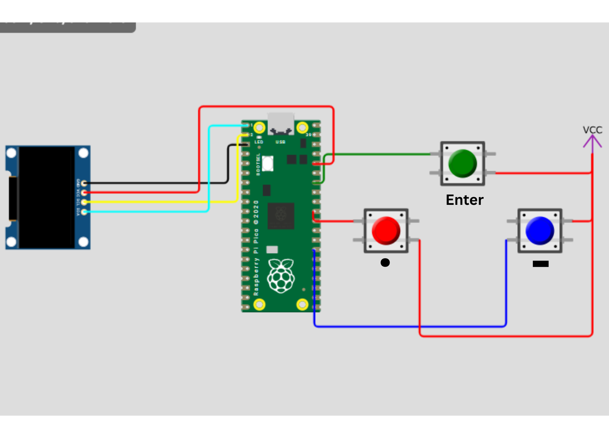

# Pi_Pico_Scrambler
This is a project based on the Raspberry Pi Pico W that uses buttons to input Morse code. The Red Button is for a (.) while the Blue Button is for a (-). The Green Button is for entering the value so that the pi ppico can decode the signals into text. It then encrypts it using a chr((ord(s) - 65 + 2) % 26 + 65) which is a kind of Caeser Cypher, and then it displays the result on an OLED screen.

## Image

## Demo Gif

## Demo Link: -
[Wokwi Demo Link](https://wokwi.com/projects/462636743026749441)
