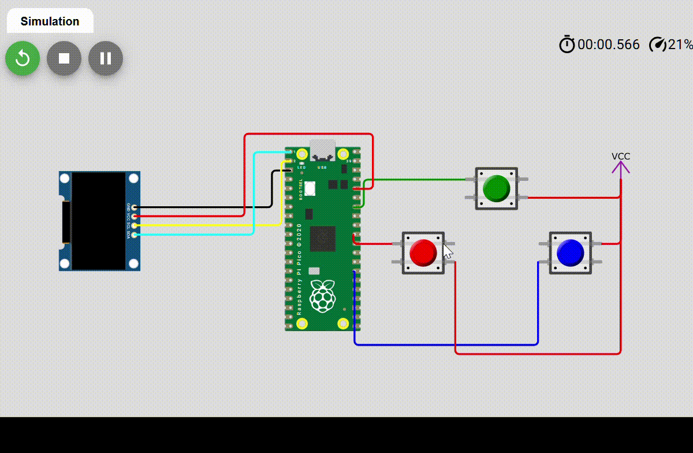

# Pi_Pico_Scrambler
This is a project based on the Raspberry Pi Pico W that uses buttons to input Morse code, decodes the signals into text, encrypts it using a Caesar cypher, and displays the result on an OLED screen.

## Demo Gif

## Demo Link: -

